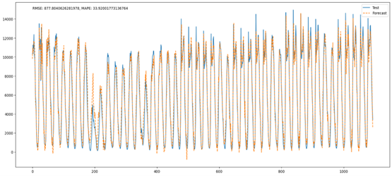

# Capstone 2 Project: Modeling Traffic Flow at Mill Road (UK)

### This project aims to develop a forecasting model for traffic flow. Such a model can be used to better time traffic signal controllers, which results in reduced commute time, air and noise pollution and better living experience for people.

## The folder structure:

Capstone_2/
    ` ` --- mill-road-trial-sensor-point-locations-2.csv - File containing locations of the sensors (Latitude and Longitude)
    ` ` --- mill_road_traffic_data.csv - File containing historical traffic data from all sensors
    ` ` --- model_metrics_params.txt - File showing the parameters, hyperparameters and metrics for the model
    ` ` --- Project Report.pdf - The Project Report
    ` ` --- Project_Notebook.ipynb - The Project Notebook
    ` ` --- Readme
    ` ` --- sensor-10-east-road-14.csv - Example data of a single sensor
    ` ` --- /images - Folder containing image files

## Abstract:

Badly timed traffic lights can cause several problems like traffic congestion, dissatisfaction for drivers, dissatisfaction for drivers, increased risk of accidents and higher pollution. Many traffic controllers use real-time traffic data to time their signals. However these are often expensive to set up and operate.
One solution to this is implementing predictive models to time the signal, which will decrease dependence on real time sensor information, possibly eliminating the need for several sensors or allow cheaper sensors and reduce costs of installation and operation.
` `This project attempts to create such a model, using data from the Mill Road Project
` `[Mill Road Project Data](https://data.world/datagov-uk/d3a76dbd-9936-4375-9ba6-e2974fafc943/workspace/project-summary?agentid=datagov-uk&datasetid=d3a76dbd-9936-4375-9ba6-e2974fafc943).
` `This is hourly data for the flow of vehicles and pedestrians at the intersection.
` `This data will be analyzed to develop a model that will predict the traffic for the next hour based on a combination of expected traffic from several days of data at the time, and recent traffic hourly data. This output can then be used to time the traffic signal appropriately.

## Conclusions:

<li> Prepared and modeled the data for time series forecasting
<li> Compared the performance of three kinds of models, an ARIMA model, an XGBoost model and a Linear Regressor
<li> The Linear Regressor model displayed better forecasting capability than the ARIMA model and atleast as good as the XGB Model for the dataset
<li> The Linear Regressor is also incredibly faster to train than the others and also meets the accuracy criteria, making it a good choice for forecasting

## Modeling:

`<b>` Data Preparation: `</b>`

<li> Scaling: We explored different scaling options, including Standard, MinMax and Log. Based on plotting the effect the transformation had on the data, it was decided MinMaxScaler was the most suitable transformation.
<li> Next we split the data into training and test set. Since we are doing a time series analysis, we took the first 20% of the available data as our training and validation and next 20% as testing.

`<b>`ARIMA`</b>`

<li> We first obtained the lagged auto-correlations to explore seasonality effects. by looking at lag ACF, we determined the seasonality order (parameter q)
<li> We then looked at the PACF to see what the AR order should be. We used a moving maximum method to compare when the deviations are within expected bounds, to then decide what the value of p should be.
<li> We used these values (p,0,q) in an ARIMA model to forecast the future values (next 20%).
<li> We tried to average the forecasted values with the measure of expected flow discussed in point 12 of the Data Exploration section. Doing so drastically improved the model accuracy.
 

  The next step was to compare to another model, we use XGBRegression  

`<b>`XGB`</b>`

<li> First we created our X and y sets by transforming the data into arrays of lagging values (X) and leading values (y)
<li> Next we created steps for a pipeline. They involved a. MinMax Scaler, b. PCA, c. XGB Regression.
<li> We used GridSearchCV with a 3-fold cross-validation to help us obtain a model with the best transformation and hyperparameters.
<li> We then noted the best parameters and forecasted the test data with this model
<li> Finally we compared the forecast to the actual test data and determined the accuracy using RMSE 
 

  We observed much better accuracy including the ability to follow specific trends better with the XGBRegressor model than with the ARIMA model, even after adjusting for statistically expected values. This means we can use the latter model with less re-training for longer 

`<b>`Linear Regressor`</b>`

<li> We used the same data, input format and transformation as for XGB Regressor
<li> The linear regressor can be trained in a fraction of the time as the ARIMA or XGB Regressor
<li> The linear regression model outperformed the ARIMA and is atleast as accurate as the XGB Regressor
<li> Given these observations, the linear regressor seems to be the model of choice. 
 

`<b>` Model Training and Performance Comparison`</b>`
` `
| Model                                | Training Time [minutes] | MAPE | RMSE |
|------------------------------------  |:-----------------------:|:----:|:----:|
| ARIMA (27,1,5)                       | 0.5                     | 199  | 3677 |
| ARIMA (27,1,50)                      | 8.75                    | 147  | 2433 |
| ARIMA (27,1,50) with expected sensor value | 8.75            | 80   | 2205 |
| XGBoost Regressor                    | 5.0                     | 33   | 878  |
| Linear Regressor                     | 0.4                     | 16   | 731  |

## Additional Discussion

We can remove some sensors that are correlated to others, reducing the installation and maintenance/monitoring costs.
` `
` ` To note are:

<li> Continue monitoring the traffic to ensure the correlations hold
<li> Short term trends may differ from overall observed correlations
